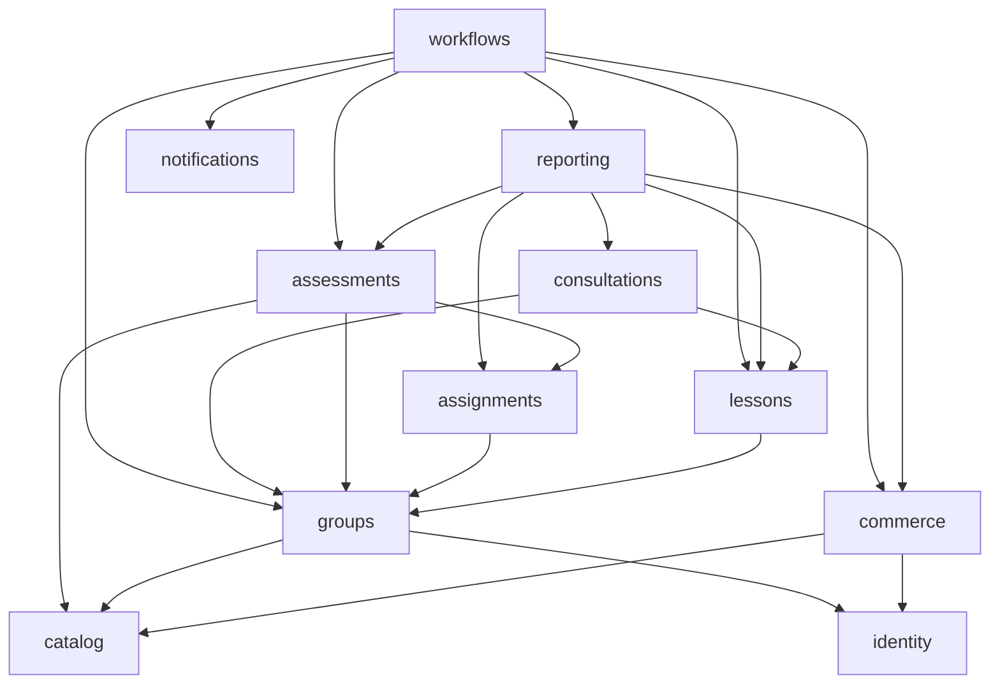

# Backend capability components

Status: target; all application components remain unimplemented. Preserve [ADR-0001](decisions/0001-modular-monolith-boundaries.md) and [ADR-0002](decisions/0002-owned-persistence-and-history.md). The [model](model.json) is the complete public-contract import allowlist. Requirement-impact additions are Proposed under [ADR-0008](decisions/0008-approved-requirement-impact.md); an allowed edge is permission, not mandatory coupling.

## Responsibilities

| Module | Owned capability | Requirement impact |
| --- | --- | --- |
| identity | Accounts, child/guardian profiles, active/main relationships, invitations, consent versions, grants, authentication metadata and teacher-readiness records | FR-001, FR-014, FR-019, FR-020, NFR-001 |
| catalog | Subjects, target groups, definitions, immutable program/content/question/criteria versions, required elements, entry/completion/progression and retake policies | FR-002, FR-003, FR-008–FR-011, FR-017, FR-023 |
| groups | Scheduled groups, teacher assignments, capacity, reservations, enrollment/participation and organizational cases | FR-004–FR-006, FR-014, FR-021 |
| lessons | Lesson occurrences, meeting information, attendance, material associations and disruption/change decisions | FR-006, FR-021, FR-024 |
| assignments | Homework, submissions, practice, hints and manual feedback | FR-007, FR-008, FR-023 |
| assessments | Diagnosis, exam/retake attempts, grading/review, versioned completion and progression exceptions | FR-003, FR-005, FR-009–FR-011; no paid/free commerce entitlement |
| consultations | Authorized archived threads/messages, access policy and shared weekly quota usage | FR-013–FR-015 |
| commerce | Offer/price/tax and settlement-plan versions, purchased snapshots, term-change acceptance, orders, payments, refund decisions/evidence, sales documents and durable payment delivery | FR-002, FR-004, FR-018, NFR-002, NFR-010; no retake product |
| reporting | Authorized progress summaries, derived KPI/cohorts, continuation qualifications and satisfaction surveys | FR-012, FR-024; gains public read access to commerce |
| files | Private object metadata, quarantine/scan evidence, validation limits and storage/scanner adapters | FR-007, NFR-007 |
| notifications | Deduplicated transactional intents and bounded delivery status | FR-016, NFR-010 |
| audit | Protected append-only important/privileged-action evidence | FR-015, NFR-008 |
| workflows | Checkout, fulfillment, participation, completion, free-retake coordination, service-change/refund coordination and notification routing | Composes owner contracts; owns no business tables |

Organizational case status in groups links owner-specific decisions by opaque IDs; it does not become a second refund, guardian-dispute or grading authority. Teacher readiness in identity records approved checks and training, not legal conclusions. Operational availability/restore evidence is maintained by operations outside product business persistence.

## Dependency direction

The model contains the full edges to identity, files, audit and other public APIs. No capability imports workflows or reporting. Reporting never writes source records or supplies authoritative progression decisions. Files never grants learning entitlement. Provider implementations remain inside their owner infrastructure.

Assessments reads group authority; groups never reads assessment persistence. Participation orchestration obtains the configured prerequisite decision and activates enrollment in one local transaction. Commerce commits verified payment/delivery facts without calling groups; workflows performs deduplicated enrollment fulfillment. Retakes consult educational eligibility and serialize attempt creation without commerce. Completion without an exam gathers required-element evidence through lessons/assignments public queries and asks assessments to finalize the versioned completion; no reverse dependency from lessons to assessments is needed.

## Packages and frontend

Root package: `pl.eszkola`. Only `pl.eszkola.<owner>.api` crosses modules. Private packages remain `application`, `domain`, `infrastructure`, `interfaces`. Public DTOs cannot import private entities/services; domain code has no HTTP, ORM or provider dependency. Application coordinates rules/ports, infrastructure implements adapters and interfaces handles HTTP. A small composition root wires components without owning business data.

Extract genuinely shared technical IDs, decimal money/currency, instants and trusted actor context only when needed. Do not introduce shared repositories/entities or empty speculative layers.

Angular remains organized by identity, catalog/checkout, learner, teacher, parent reports and content/operations workflows, with feature-owned typed API clients and routing. The shell owns navigation/session UX; shared UI owns no business policies. Child credentials/context remain separate from guardian purchasing authority. Polish responsive next-action/status flows cover pending grading, unavailable seats, rejected files and unresolved service changes. Guards and hidden controls are UX; all decisive checks remain server-side.
