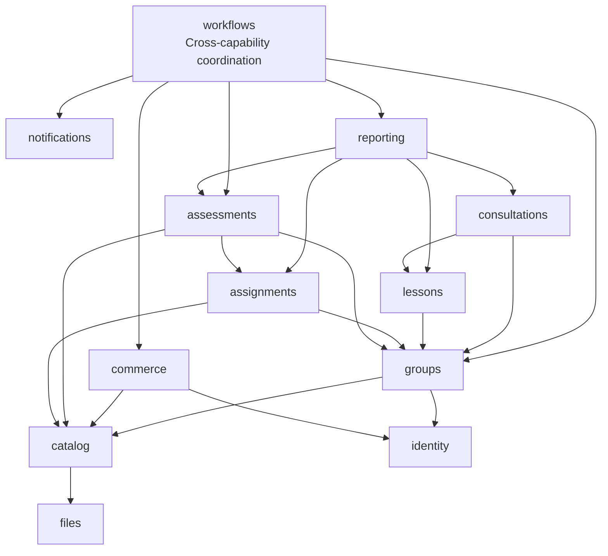

# Backend capability components

Status: target, none implemented. Decisions: [ADR-0001](decisions/0001-modular-monolith-boundaries.md) and [ADR-0002](decisions/0002-owned-persistence-and-history.md). The dependency allowlist is authoritative in [model.json](model.json). An allowed edge is permission, not a requirement to add a dependency.

## Module responsibilities

| Module ID | Owned capability | Public contract examples |
| --- | --- | --- |
| `identity` | Actor identity, parent/child profiles, guardian relations, consents, role grants and MFA/session metadata | Resolve verified actor; guardian access decision; consent status |
| `catalog` | Subjects, age bands, paths, module definitions, published program/lesson plans, question versions, rubrics and educational policies | Published program manifest; assessment content for trusted server grading; learner-safe content |
| `groups` | Scheduled cohorts, teacher assignments, seat reservations, enrollment and participation status | Reserve/confirm a seat; enrolled resource scope; activate participation |
| `lessons` | Actual lesson occurrences, external meeting references, attendance and lesson material associations | Authorized schedule/join information; attendance summary |
| `assignments` | Assigned homework, submissions, practice attempts, hints and teacher feedback | Submission/feedback; practice outcome evidence for retake readiness |
| `assessments` | Diagnosis, exam/retake attempts, grading decisions, final module completion and educational exceptions | Final completion/eligibility decision; attempt creation; approve/revise grading |
| `consultations` | Scoped question threads, bounded communication, quotas, lifecycle and archive | Request/accept/reply/close; authorized archive |
| `commerce` | Price/tax configuration, order snapshots, payment/refund records, retake entitlements, verified callback inbox and fulfillment outbox | Quote/order; verified paid entitlement; pending fulfillment delivery |
| `reporting` | Report assembly and explicitly generated report snapshots | Parent report; educational summaries, with source result revision |
| `files` | Private object metadata, quarantine/scan status, limits and storage adapters | Upload intent; scan status; authorized storage operation after owning capability checks |
| `notifications` | Transactional email intents, templates and delivery status | Enqueue deduplicated message; delivery outcomes |
| `audit` | Append-only records for privileged and important actions | Append bounded event in caller transaction; restricted audit query |
| `workflows` | Cross-module application coordination: checkout/reservation, fulfillment, progression, paid retakes, notification routing | User-facing coordinated use cases and scheduled delivery handlers |

Supporting modules are in the same deployable, not extra services. `workflows` owns no educational/payment truth or entity tables; delivery records remain with their producing owner. `reporting` does not query other modules' tables and cannot unlock progression. `files` does not grant learning access itself.

## Dependency direction

This diagram highlights business edges; [model.json](model.json) includes complete edges to identity, audit, files and other public contracts. Arrows mean consumer imports provider's public API. No leaf imports `workflows`, `reporting`, or a consumer. Domain modules do not directly depend on `notifications`; workflows routes committed facts to email intents. This prevents mail/provider failures from blocking grading/payment commits.

Two potential cycles are intentionally resolved:

- Assessments consult groups for enrollment and teacher scope. Groups do not consult assessments: the `StartParticipation` workflow obtains the final prerequisite decision and commands groups in one local transaction.
- Commerce records paid facts without invoking groups. Workflow fulfillment consumes commerce delivery through its public contract and commands groups with a deduplication key. Checkout coordinates seat reservation and order snapshots. Additional paid retakes compose commerce entitlement with assessment eligibility without introducing reciprocal dependencies.

## Target package boundaries

Backend root package: `pl.eszkola`. Module layout: `pl.eszkola.<module>.api` for explicit DTO/interface contracts, and private `application`, `domain`, `infrastructure`, `interfaces` packages. `interfaces` contains HTTP endpoints; infrastructure contains persistence/provider adapters. Public API contracts must not import private application/domain/entity classes. Domain has no HTTP/provider/ORM dependencies. Application coordinates domain and abstract ports; infrastructure implements ports. Boot wiring belongs in a small composition root, with no business data or rules.

Within a module, adapt the layout to actual need rather than creating empty layers. Only public `.api` contracts may cross modules, restricted by the allowlist. Shared technical value types (opaque IDs, decimal money with currency, instants, validated actor context) may be extracted when truly shared; no generic shared entity/repository or hidden shared domain policy is allowed. Migration ordering is global; table ownership is module-specific.

## Frontend boundaries

Target feature areas: identity, catalog/checkout, learner work, teacher work, parent reporting and content/operations administration. Feature-owned typed API services expose server DTOs; routing belongs to the feature. App shell handles navigation/session state. Shared UI has no business persistence or cross-feature services. Features may compose capability APIs without mirroring every backend module as a screen. Route guards improve UX; API resource checks remain decisive. Exam models must omit answer keys. Exact Angular tooling and enforceable import rules are selected during bootstrap, without requiring Nx or another large dependency.
