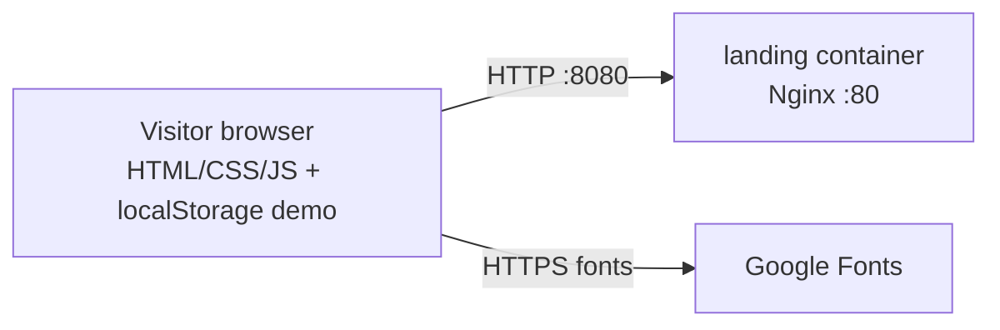
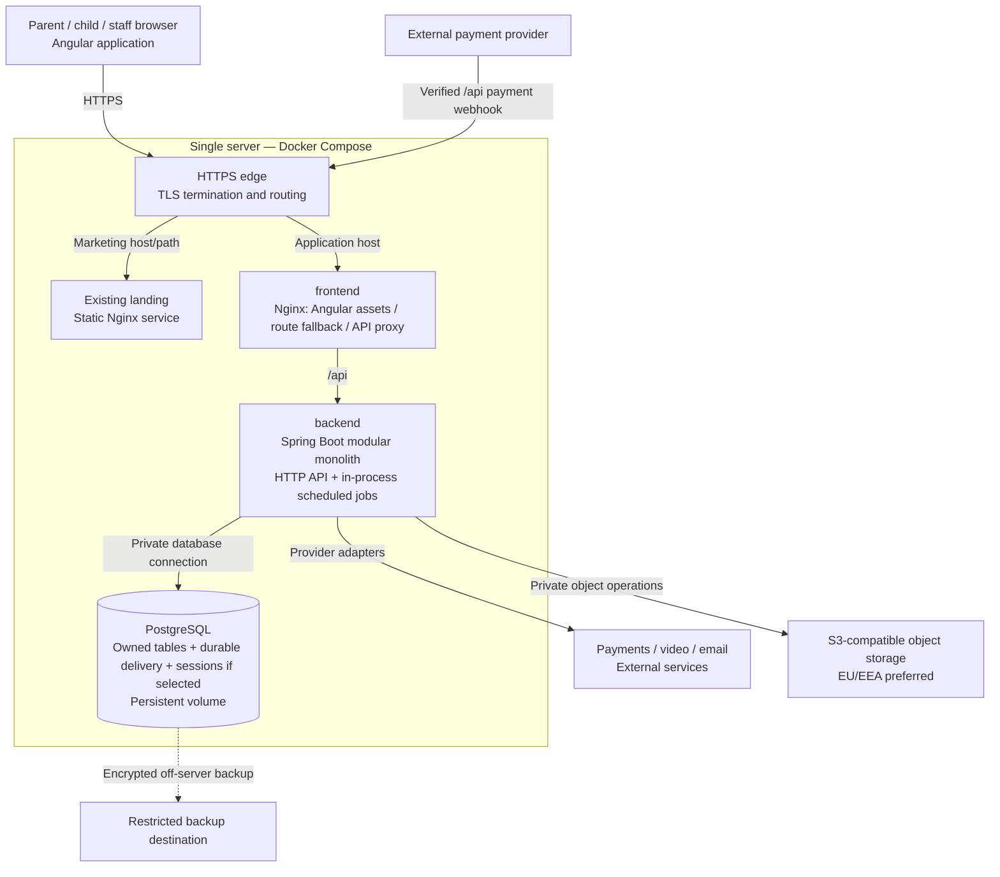

# C4 level 2 — containers

## AS-IS

Defined by `landing/docker-compose.yml`. No server storage, API, authenticated UI or TLS endpoint is currently configured.

## TO-BE

The edge can be integrated into the production frontend web server or provided by a host reverse proxy; no extra distributed service is mandated. The chosen arrangement must preserve application same-origin `/api` access, landing, TLS, correct forwarded headers and webhook routing. It is an implementation topology decision within ADR-0005.

| Container/boundary | Responsibility | Exposure / state |
| --- | --- | --- |
| landing | Marketing and existing demo behavior | Static files; no production child/account data |
| frontend | Angular feature workflows, accessible Polish interface, dedicated typed API clients | Browser assets; no credentials/long-lived tokens in browser storage |
| backend | Domain capabilities, authorization, integration adapters, scheduled durable delivery | Private service port; no exposed admin/metrics endpoint |
| PostgreSQL | Business state, unique constraints, versioned migrations, delivery/session state | Private network; persistent named volume, separately backed up |
| Object storage | Quarantined/scanned private materials and submissions | Private buckets; controlled expiring access after capability authorization |

Backend/frontend containers, PostgreSQL, TLS and production routing are target-only. Exact image/runtime versions, secrets provisioning and hostnames await bootstrap. See [deployment](deployment.md) for migration/readiness/backup responsibilities.
