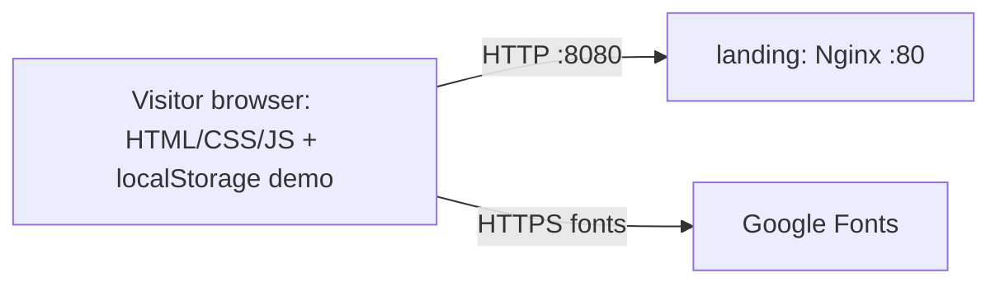
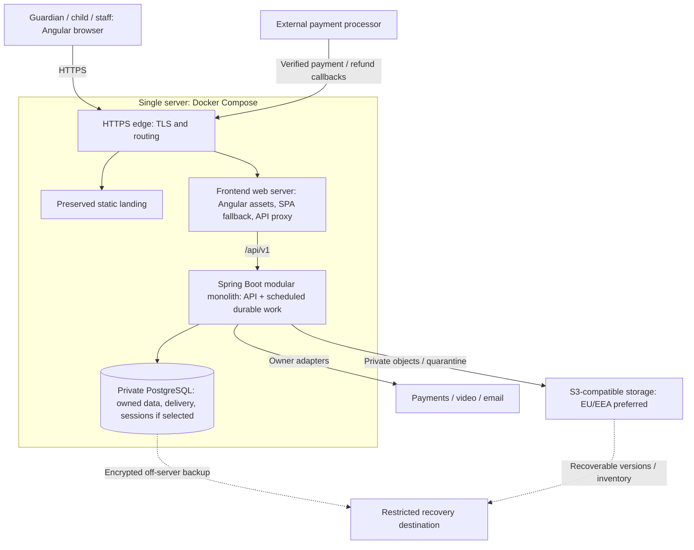

# C4 level 2 — containers

## AS-IS

Only landing Compose exists; no server account storage, API, authenticated application or configured TLS boundary is implemented.

## Retained target topology

ADR-0005's topology is preserved. Edge may be integrated with the frontend server or host proxy, retaining same-origin API, landing/TLS and trusted forwarding. No new service is required for KPI, cases, MFA, quota or refund coordination. Provider/credential selection and session persistence remain separate choices.

| Boundary | Responsibility / exposure |
| --- | --- |
| landing | Static marketing/demo; no production child/account persistence |
| frontend | Polish responsive feature flows and typed APIs; no long-lived browser-storage secrets |
| backend | Resource-authorized capability rules, bounded owner adapters and in-process durable workers; private service/management ports |
| PostgreSQL | Owner-prefixed tables, uniqueness, versioned migrations and durable work; persistent volume plus independent backup |
| S3 | Private quarantined/scanned materials/submissions; expiring authorized operations and matching backup inventory |
| Recovery | Off-server database plus object evidence, protected audit and provider references; measured RPO/RTO |

All new containers/routing/migrations/health/TLS remain unimplemented. The diagram adds object recovery alongside database recovery because NFR-004 explicitly includes service files. No current-version compatibility or operational objective is claimed to be verified. See [deployment](deployment.md) and [nfr.md](nfr.md).
