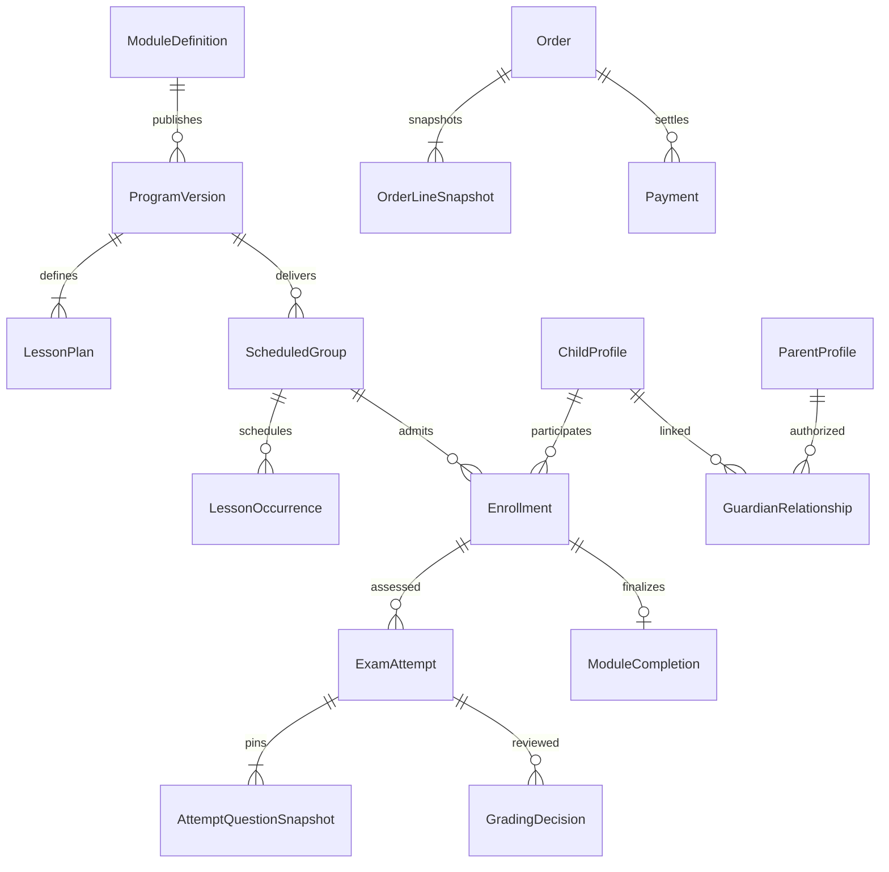

# Logical data model and ownership

Target-only. This is not a physical schema or migration. [model.json](model.json) records one owner for every logical entity named here; physical tables, fields and indexes require feature-specific design. Decisions: [ADR-0002](decisions/0002-owned-persistence-and-history.md), [ADR-0003](decisions/0003-durable-effects-and-payments.md).

## Ownership

| Owner | Logical persistent data |
| --- | --- |
| identity | ActorAccount, ParentProfile, ChildProfile, TeacherProfile, GuardianRelationship, ConsentRecord, RoleGrant, AuthenticationState |
| catalog | Subject, AgeBand, LearningPath, ModuleDefinition, ProgramVersion, LessonPlan, LearningOutcome, AssessmentPolicyVersion, QuestionVersion, GradingCriteriaVersion, ProgramMaterial |
| groups | ScheduledGroup, TeacherAssignment, SeatReservation, Enrollment |
| lessons | LessonOccurrence, MeetingReference, Attendance, LessonMaterial |
| assignments | Assignment, Submission, PracticeAttempt, HintUsage, AssignmentFeedback |
| assessments | DiagnosticAttempt, ExamAttempt, AttemptQuestionSnapshot, GradingDecision, ModuleCompletion, ProgressionOverride |
| consultations | ConsultationThread, ConsultationMessage, ConsultationPolicyVersion |
| commerce | PriceConfiguration, Order, OrderLineSnapshot, Payment, Refund, RetakeEntitlement, ProviderCallback, CommerceDelivery |
| reporting | ProgressReportSnapshot |
| files | FileObject, FileScan |
| notifications | NotificationIntent, EmailDelivery |
| audit | AuditEvent |
| workflows | No business persistence. Coordinates through owning contracts. |

`AuthenticationState` abstracts the local metadata needed by the eventual identity choice; it does not decide to store passwords or introduce a new identity service. Consent records contain policy/version/purpose, actor, timestamp and revocation state; they are not a substitute for legal basis decisions.

## Key relationships

Cross-owner lines express identifiers and public-contract checks, not permission to join/update another module's data. Relations and cardinalities need feature validation (for example guardian multiplicity); the graph does not require a single parent per child or a single payment attempt per order.

## Database boundaries and transactions

One PostgreSQL database with owner-prefixed table names (`identity_*`, `catalog_*`, etc.) and a globally ordered versioned migration stream. The prefix matches module IDs. Use one application transaction across explicit public contracts for tightly coupled local changes: seat reservation + order creation, payment fulfillment + enrollment + consumed-delivery marker, prerequisite check + participation activation, approved grade + completion + audit. No module writes foreign tables. Database constraints support the owners' invariants; foreign keys across modules may protect immutable references but cannot imply cross-owner access or cascading deletion of history. If an entity is deletable, define the referenced-ID/anonymization strategy explicitly.

Use database uniqueness for callback `(provider, merchantAccount, eventId)`, fulfillment per order line, retake-entitlement consumption, notification deduplication and owner-defined reservation/enrollment keys. Additional keys handle distinct provider events describing the same payment. Business uniqueness of `(child, group)` and reenrollment after cancellation must be resolved with product; do not assume history can be overwritten.

Owners use optimistic version checks or explicit row locks for payment transitions, seat capacity, entitlement consumption, grade finalization and consultation quota. Lock-order and race tests accompany implementation. Serialize eligibility and completion changes for the same child/module scope during `StartParticipation`; otherwise a grade correction could race activation. Do not read a reporting snapshot for a start decision.

## Historical integrity

Draft programs/questions can be edited. Publishing freezes a `ProgramVersion` manifest containing lesson plans, outcome criteria, prerequisite references, assessment blueprint, question/rubric/policy version references and retake policy. A scheduled group pins one published program; enrollments and attempts retain that reference. Question/criteria versions may not be mutated or deleted while referenced.

At attempt creation, pin selected question versions, grading criteria, rules, ordering/randomization selection, time allowance and approved accommodations. Snapshot rendered question/criteria data or retain immutable version records with equivalent historical reproducibility; migrations must not rewrite historical meaning. Record deadline and server submission instants. Pending manual review yields a preliminary result; only a final approved grading revision establishes completion. Corrections append grading decisions and audit records with reason and actor; preserve prior results and invalidate/revise derived reports. How corrections affect participation already started is an explicit product decision, not an automatic cancellation rule.

Question content/keys are catalog-owned. Attempt answers and grading decisions are assessment-owned. Homework/practice attempts are assignments-owned, including their pinned question versions. Progression exceptions are assessments-owned scoped decisions with reason, authorizing educational actor and audit link; groups records the activation reference but does not own the educational exception.

Orders pin gross/net/tax treatment, currency, quantity, product reference, program version, reservation reference and applicable terms/pricing version. Prices are decimal-safe; never persist/calculate money using binary floating point. Catalog owns educational retake eligibility; commerce owns paid/free entitlement accounting; assessment attempts record consumed entitlement and attempt ordinal.

## Time and derived data

Store significant event instants with PostgreSQL timezone-aware timestamps and Java `Instant`/offset-aware DTOs. Store schedule authoring zone `Europe/Warsaw` alongside intended local date/time where recurrence or rescheduling needs it; resolve to exact instants. Reject or explicitly disambiguate DST gaps/overlaps; do not infer from server-local zone. Date-only birth/education/calendar values stay dates and are collected only if required.

Reporting initially assembles current summaries through public queries. A generated report snapshot names source program/attempt/grading revision and generation instant; it is replaceable/revisable derived data. Notifications and provider fulfillment are eventually consistent with explicit durable statuses. Educational/payment truth is transactionally committed by owners, independently of provider mail availability.

## Retention and deletion

Retention is configurable per data class after product/legal review. Deleting a parent/child profile must not cascade away required payment evidence or historical assessments indiscriminately. Export/deletion workflows call owners; minimize identifiers or pseudonymize retained evidence according to the approved retention policy. Backups and object versions must be included in that policy. No retention duration or legal obligation is invented by this baseline.
