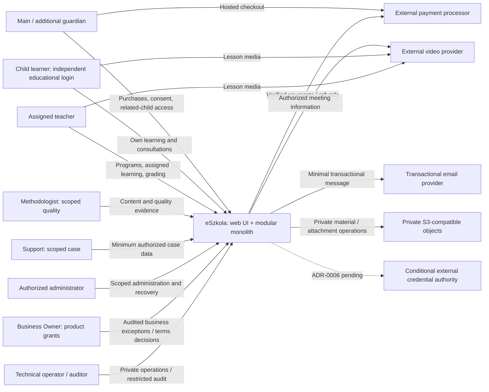

# C4 level 1 — system context

AS-IS: visitor → static Nginx landing → demo waitlist in that browser's localStorage. Browser also loads Google Fonts. There is no server signup, educational account or running platform integration.

## Target actors and systems

External credentials are conditional, not a selected service. Main/additional guardians have different relationship-management authority; child has no purchasing authority. Product Business Owner grants include approved business exceptions, but BA/SA approval occurs solely in repository governance and is not a product feature.

Video media bypasses eSzkola; links may be entered by authorized staff without a mandatory provider API. No default recording, private teacher contact, public child profiles or open social chat is proposed. Providers receive purpose-minimal data. Existing topology decisions remain unchanged; the actor/authority refinement follows FR-001/FR-005/FR-014/FR-019.

Browsers are untrusted. HTTPS/API authenticates, validates and checks resource access. Provider callbacks require verified server authority; browser returns cannot confirm payment/refund. PostgreSQL and S3 buckets remain private; authorized short-lived object access is a controlled exception to backend-proxied bytes. See [security](security.md), [integrations](integrations.md) and [containers](containers.md).
