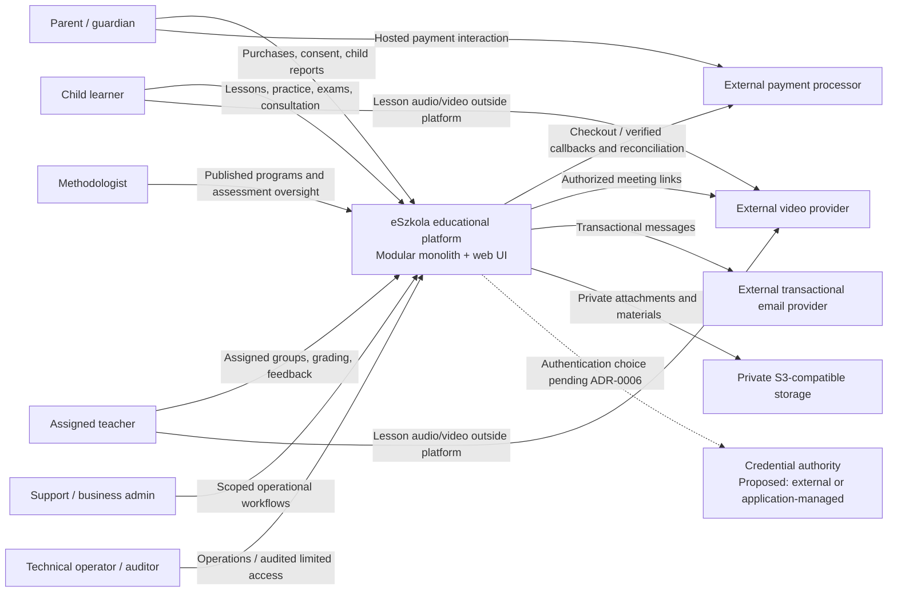

# C4 level 1 — system context

## AS-IS

Visitor → static Nginx landing → local demo waitlist in that visitor's browser. Fonts load from Google Fonts. There is no educational platform or server signup integration. The landing's product branding is not evidence of a separate system boundary.

## TO-BE

The external identity node is conditional, not an accepted added service. Video can initially use administrator-entered links rather than a provider API. Children never initiate payments; guardians interact with the hosted payment provider. Video media bypasses eSzkola and recordings are not baseline functionality.

## Trust boundaries

Browsers are untrusted clients. The HTTPS/API boundary authenticates, validates and authorizes each operation. External callbacks require provider-specific verification; browser returns do not confirm payments. PostgreSQL and object storage are private infrastructure; only the backend accesses business tables. Short-lived authorized object URLs are an explicitly controlled exception to backend-proxied bytes. Third-party services receive the minimum information for their purpose. Detailed rules are in [security](security.md) and [integrations](integrations.md).
